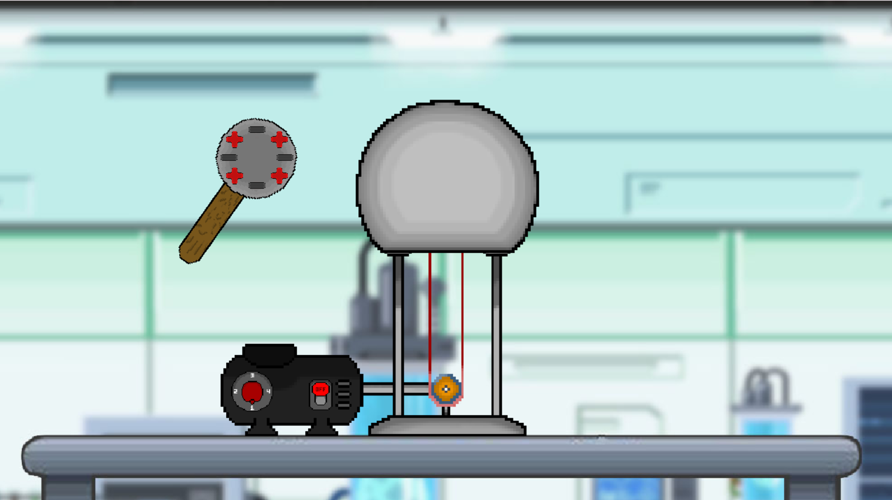
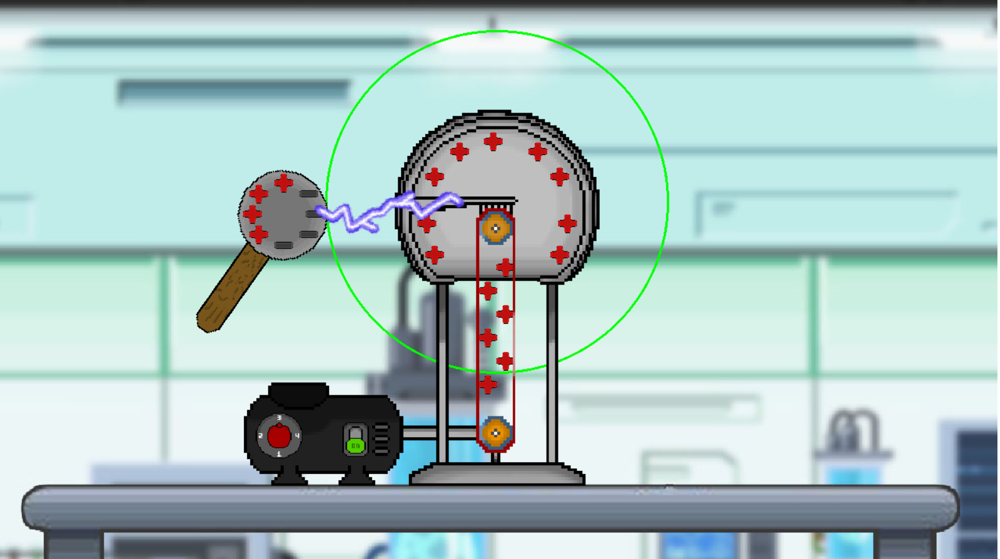

# Simulation - Van der Graaff Generator

The Van de Graaff Generator is an electrostatic device used to generate large amounts of electric charge, creating high voltages. Its operating principle is based on the use of an insulating belt that carries electric charge to a metallic sphere, where the charge is accumulated and stored.

### Key Features:

- High voltage generation.
- Use in scientific and educational research.
- Demonstrations of static electricity and high-voltage discharge.

### Generator off

### Generator on

>[!] NOTE 
>
>In the development of this simulation, I am joined by my friend and classmate, [Alef Joseneudo](https://github.com/alefjmelo), who is responsible for the visual design
